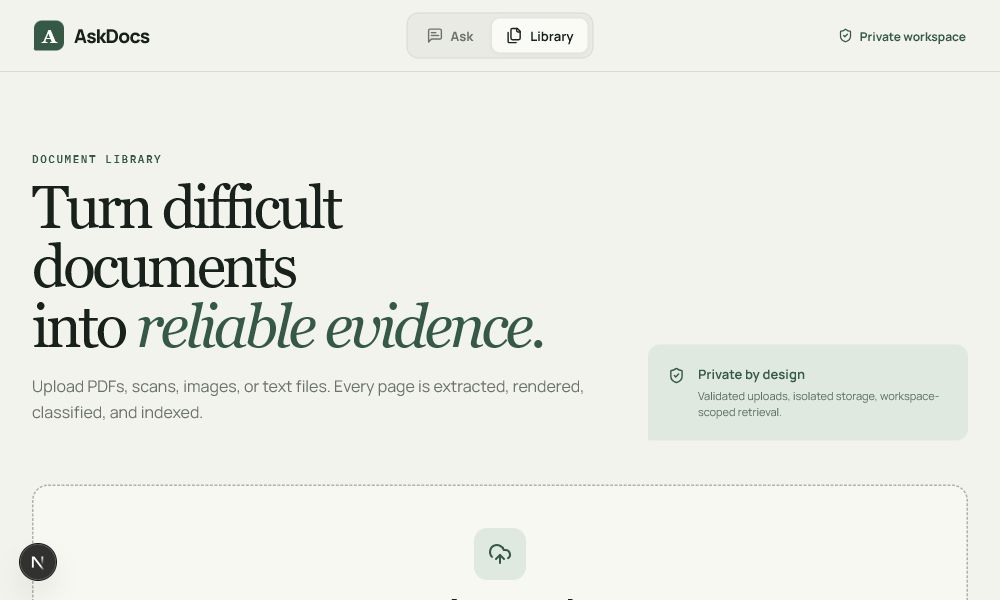
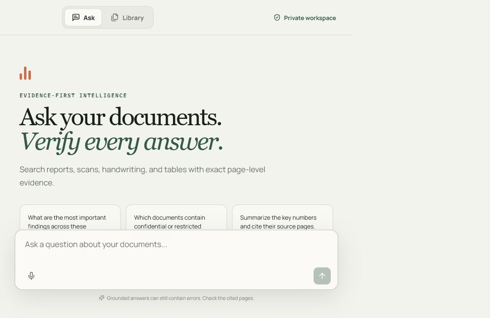
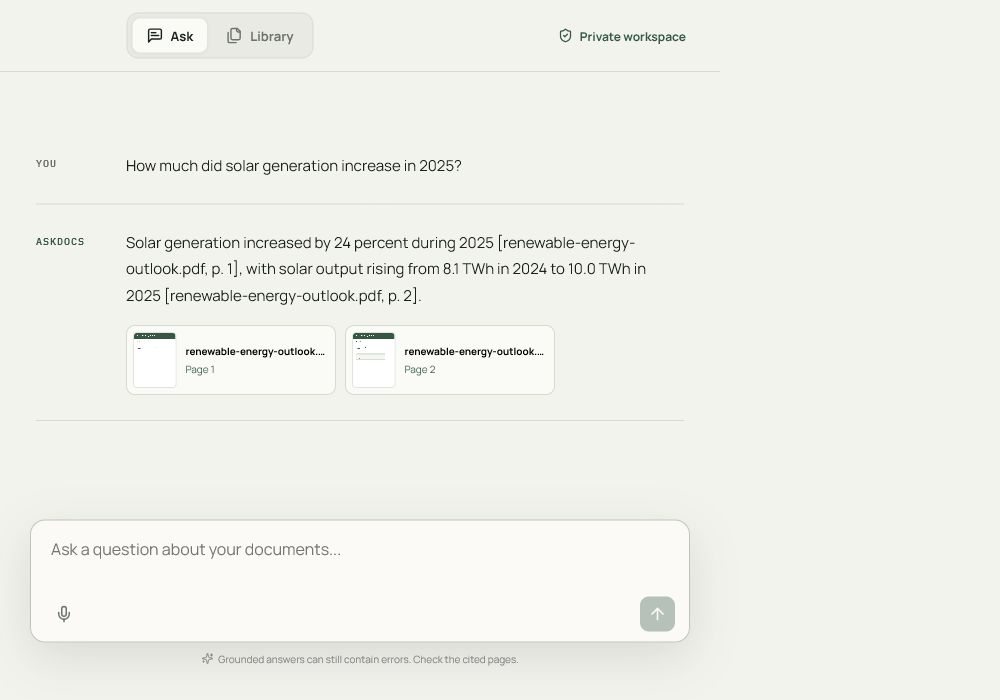
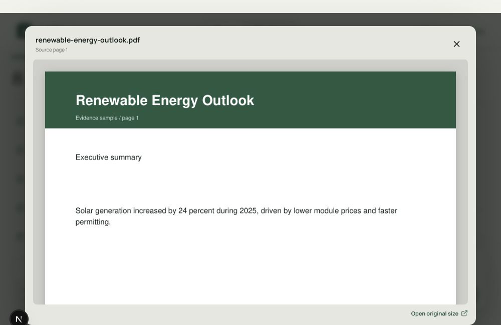
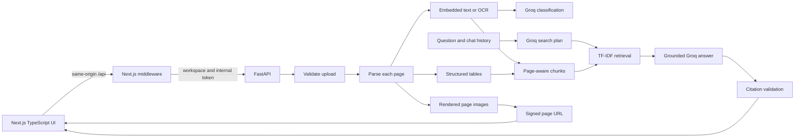

# AskDocs

AskDocs is a document intelligence application built for the Build Fast with AI engineering assessment.

It accepts PDFs, scans, images, and text files. Each page is extracted and rendered, every document is classified, and the chat interface answers questions using evidence from the uploaded documents. Answers include the document name, page number, and a clickable image of the source page.

The repository includes six sample PDFs, so the main flow works on first run.

> Deployment link: add the final frontend URL here before submission.

## App Screenshots

### Upload and document library



### Ask questions across the knowledge base



### Grounded answer with page citations



### Open the exact cited page



## What It Does

- Upload up to ten PDF, PNG, JPG, or TXT files at once.
- Extract embedded PDF text and use OCR when a page has little or no text.
- Extract PDF tables as rows and cells instead of flattening them into plain text.
- Render and store an image for every page.
- Classify documents with Groq and validate the result as structured JSON.
- Search page-aware chunks using an LLM-generated search plan and TF-IDF ranking.
- Answer only from retrieved evidence.
- Show inline citations with the document name and page number.
- Show the cited page as a thumbnail and in a full-page viewer.
- Keep conversation history for follow-up questions.
- Accept live voice input in supported browsers.
- Let users view or permanently remove their own completed uploads.
- Protect the bundled sample documents from deletion.

## Quick Demo

1. Open `/upload`.
2. Upload one or more files, or use the six bundled samples.
3. Watch each file move through `Parsing`, `Classifying`, `Indexing`, and `Ready`.
4. Expand a row to see its document type, topics, sensitivity, language, summary, and confidence.
5. Select **View document** to inspect its rendered pages.
6. Open `/` and ask:

```text
How much did solar generation increase in 2025?
```

The answer should cite `renewable-energy-outlook.pdf`, pages 1 and 2. Select either citation card to open the source page.

To check no-answer behavior, ask something unrelated to the documents:

```text
What is the launch code for a submarine on Mars?
```

The application should say that it cannot find enough relevant evidence instead of inventing an answer.

## Assignment Coverage

| Assessment requirement | How AskDocs covers it |
| --- | --- |
| Scanned PDFs | Pages with little embedded text are rendered and passed through Tesseract OCR. |
| Handwritten pages | Handwriting uses the same OCR path. This is best-effort because Tesseract is not a specialist handwriting model. |
| Image-heavy reports | Every PDF page is rendered with PyMuPDF and stored as a JPEG. |
| Embedded PDF text | Text is extracted page by page with PyMuPDF. |
| Tables as structure | `pdfplumber` stores tables as rows and cells. Table content is also included during retrieval. |
| Plain text files | Text is read directly and rendered into a page image. |
| Text and image per page | Every parsed page has extracted text, page number, rendered image path, and any extracted tables. |
| LLM document classification | Groq returns a structured classification that is validated with Pydantic. |
| Multiple classification dimensions | The schema contains document type, topics, content characteristics, sensitivity, language, summary, and confidence. |
| Agentic RAG | Groq creates one to four search queries from the question and chat history before retrieval. |
| Relevant retrieval | Page-preserving chunks are ranked with TF-IDF and cosine similarity. |
| Grounded answers | Groq receives only the retrieved evidence and an exact list of allowed citation tokens. |
| Inline citations | Answers use `[document name, p. N]`. The API exposes citations only when the exact token appears in the answer. |
| No hallucination on empty results | If retrieval finds no useful evidence, the API returns a clear insufficient-evidence response. |
| Multi-turn chat | Previous user and assistant messages are included in search planning and answer generation. |
| Citation thumbnails | Each citation card displays the rendered source page. |
| Full-page source view | Selecting a citation opens the page in a modal. |
| Separate bulk upload page | `/upload` supports multiple files and shows status per document. |
| Five or more samples | Six sample PDFs are included and indexed automatically on first startup. |
| Voice input bonus | The chat composer uses the browser speech-recognition API and shows the live transcript. |
| Security at every layer | Upload, storage, processing, API, retrieval, and deletion controls are described below. |

## Architecture



### Main technology choices

- **Next.js and TypeScript** for the frontend required by the assessment.
- **FastAPI and Python** for the API and document pipeline.
- **PyMuPDF** for page-level PDF text extraction and rendering.
- **pdfplumber** for structured table extraction.
- **Tesseract** for local OCR without a paid OCR service.
- **Groq** for fast, free-tier LLM classification, search planning, and answer generation.
- **Pydantic** for validating model output before it is stored.
- **TF-IDF and cosine similarity** for transparent local retrieval. This is enough for the small assessment knowledge base and requires no hosted vector database.

## Processing Flow

1. The API validates the file type, size, extension, and binary signature.
2. The original file is stored under a server-generated ID.
3. PDFs are processed page by page. Images and text files are converted into the same page record format.
4. A rendered JPEG is saved for every page.
5. Embedded text is extracted. Sparse pages and image uploads use OCR.
6. Tables are stored as nested rows and cells.
7. Groq classifies the whole document into structured JSON.
8. The document becomes available to retrieval only after indexing finishes.

## Classification Schema

```json
{
  "document_type": "risk review",
  "topics": ["vendor risk", "data retention"],
  "content_characteristics": ["policy", "decision record"],
  "sensitivity": "confidential",
  "language": "English",
  "summary": "A review of vendor controls and approval conditions.",
  "confidence": 0.94
}
```

Groq output is validated with Pydantic. If the provider is unavailable or returns invalid JSON, processing falls back to a simple local classification instead of leaving the document stuck.

## RAG and Citation Rules

The citation flow is intentionally strict:

1. Groq creates search queries using the latest question and previous conversation turns.
2. Retrieval searches chunks that keep their document and page identity.
3. The highest-ranked chunks are sent to Groq as untrusted evidence.
4. Groq also receives an allow-list such as `[renewable-energy-outlook.pdf, p. 1]`.
5. A citation is returned to the frontend only if that exact token appears in the answer.
6. If relevant evidence exists but the model returns no valid citation, the API replaces it with a cited extractive answer.
7. If no relevant evidence exists, the API refuses to answer from general knowledge.

This does not make an LLM infallible, but it prevents fabricated document links and gives the user the exact page needed to verify the answer.

## Project Structure

```text
app/                    Next.js routes and global styles
components/             Chat, upload, classification, citation, and viewer UI
lib/                    Frontend types and API client
middleware.ts           Adds workspace scope and the backend credential
backend/app/            FastAPI, parsing, Groq, retrieval, storage, and security
backend/tests/          API, parser, retrieval, deletion, and security tests
samples/                Six documents indexed automatically on first run
docs/screenshots/       README screenshots
scripts/                Sample generator and backend smoke test
.github/workflows/      Frontend and backend CI
render.yaml             Render deployment configuration
```

## Run Locally

### Requirements

- Node.js 22 or newer
- Python 3.12 or newer
- Tesseract OCR available on `PATH`
- A Groq API key

Tesseract is needed for new scans and image-only uploads. PDFs with embedded text still work without it.

### 1. Create the environment file

From the repository root:

```powershell
Copy-Item .env.example .env
```

Set the following values:

```dotenv
GROQ_API_KEY=your_groq_api_key

APP_INTERNAL_TOKEN=choose-one-long-random-value
BACKEND_INTERNAL_TOKEN=use-the-exact-same-value

APP_SIGNING_SECRET=choose-a-different-long-random-value
BACKEND_API_URL=http://127.0.0.1:8000
WORKSPACE_ID=demo-workspace
APP_ORIGINS=http://localhost:3000
```

`APP_INTERNAL_TOKEN` and `BACKEND_INTERNAL_TOKEN` must match. They connect the Next.js server to FastAPI. These values stay in `.env`; they do not need to be entered on every run.

Never expose the Groq key with a `NEXT_PUBLIC_` variable.

### 2. Install and start the backend

```powershell
python -m venv .venv
.venv\Scripts\python.exe -m pip install -r backend\requirements.txt
Set-Location backend
..\.venv\Scripts\python.exe -m uvicorn app.main:app --reload --port 8000
```

### 3. Install and start the frontend

Open another terminal in the repository root:

```powershell
npm.cmd install
npm.cmd run dev
```

Open [http://localhost:3000](http://localhost:3000).

On macOS or Linux, use `npm run dev` and the platform's normal Python virtual-environment activation commands.

### Running without Groq

The parser, local classification fallback, retrieval, and extractive cited answers still work without a Groq key. The intended submitted demo should use Groq because LLM classification and agentic search planning are assessment requirements.

## Tests and Verification

```powershell
# Backend tests
Set-Location backend
..\.venv\Scripts\python.exe -m pytest -q

# Seeded ingestion, retrieval, citation, and signed page image
Set-Location ..
.venv\Scripts\python.exe scripts\smoke_backend.py

# Frontend checks
npm.cmd run typecheck
npm.cmd run build
```

Current verified results:

- 18 backend tests pass.
- All six bundled samples reach `indexed` status.
- Structured tables are found in the operations and renewable-energy samples.
- The smoke test retrieves `renewable-energy-outlook.pdf` and downloads its signed page image.
- TypeScript checking passes.
- The production Next.js build passes.

The tests cover upload security, signatures, workspace isolation, parser behavior, retrieval, rate limits, page manifests, protected samples, processing conflicts, path containment, and full file cleanup after deletion.

## Security Decisions

Uploaded documents can contain sensitive information. The application therefore treats security as part of the pipeline rather than a single API check.

### What is implemented

**Upload layer**

- Only PDF, PNG, JPEG, and TXT files are accepted.
- Binary file signatures are checked instead of trusting the filename alone.
- The default limit is 20 MB per file, ten files per request, and 200 pages per PDF.
- Images with unsafe pixel counts are rejected.
- Original filenames are display-only. Files are stored using random server-generated IDs.
- Upload and chat requests have per-workspace and per-client rate limits.

**Storage layer**

- Originals, extracted metadata, text, and rendered pages stay outside the frontend `public/` directory.
- Storage is separated by a validated workspace ID.
- Document API responses do not expose filesystem paths or full extracted page bodies.
- Page images use short-lived HMAC-signed URLs bound to the workspace, document, page, and expiry time.
- User-uploaded documents can be deleted only after processing finishes.
- Bundled samples cannot be deleted.
- Deletion checks that every target remains inside the configured workspace directories before removing the original, rendered pages, and metadata.

**Processing layer**

- File, image, and page counts are bounded before expensive processing.
- OCR failure returns empty OCR text; it does not execute or trust document content.
- Groq classification JSON is validated before storage.
- Provider failures use safe fallbacks instead of leaving files permanently in progress.
- Retrieved document text is marked as untrusted evidence in the LLM prompt to reduce prompt-injection risk.

**API and retrieval layer**

- The browser calls the same-origin Next.js `/api` route.
- Next.js middleware adds the internal backend credential and workspace ID server-side.
- The Groq key and backend token never reach browser JavaScript.
- Listing, page manifests, uploads, deletion, processing status, and retrieval are workspace-scoped.
- CORS is allow-listed and security headers are added by both services.
- Citation metadata is created only from retrieved pages and validated against the final answer.
- The API does not intentionally log document text, prompts, or secrets.

### Considered but not included

These need more infrastructure than this assessment project:

- Real user accounts, organization membership, and role-based access control
- Malware scanning and content disarm/reconstruction
- Private object storage with per-tenant encryption keys
- Durable background workers with retries and dead-letter queues
- Distributed rate limiting across multiple API instances
- Audit-log retention and legal-hold workflows

### What I would add next

For a production version, I would first add authentication and tenant membership, move files to private object storage, use a durable worker queue, add malware scanning, and keep an immutable audit trail for uploads, reads, and deletion.

The current internal token protects the connection between the frontend and backend, but it is not a replacement for real user authentication.

## Deployment

### Backend on Render

The included `render.yaml` uses Render's native Python runtime. Docker is not required.

Set these environment variables:

```text
GROQ_API_KEY
APP_INTERNAL_TOKEN
APP_SIGNING_SECRET
APP_ORIGINS=https://your-frontend.vercel.app
```

Render's free filesystem is temporary. The bundled samples are restored on a clean deployment, but user uploads need a persistent disk or private object storage to survive redeployments.

The production host also needs Tesseract for OCR of new image-only documents.

### Frontend on Vercel

Set these environment variables:

```text
BACKEND_API_URL=https://your-render-service.onrender.com
BACKEND_INTERNAL_TOKEN=the-same-value-as-APP_INTERNAL_TOKEN
WORKSPACE_ID=demo-workspace
```

After the frontend is deployed, update `APP_ORIGINS` on Render to the exact Vercel URL.

## Known Limitations

- Handwriting recognition is best-effort because Tesseract is designed mainly for printed text.
- TF-IDF works well for this small demo corpus but is not the best retrieval system for a large knowledge base.
- Processing runs in a bounded in-process thread pool. Restarting the API can interrupt active uploads.
- Render free-tier storage is temporary unless a persistent disk is attached.
- Voice input depends on browser speech-recognition support and works best in Chromium-based browsers.
- The demo uses one workspace and an internal service credential, not full user authentication.

## Possible Production Improvements

- Replace TF-IDF with open embeddings, pgvector or Qdrant, and a reranker.
- Move parsing and OCR into durable queue workers.
- Store originals and page images in private object storage.
- Add user accounts, organizations, roles, and audit logs.
- Add specialist handwriting OCR and more languages.
- Add evaluation datasets for retrieval quality, citation accuracy, and OCR quality.
